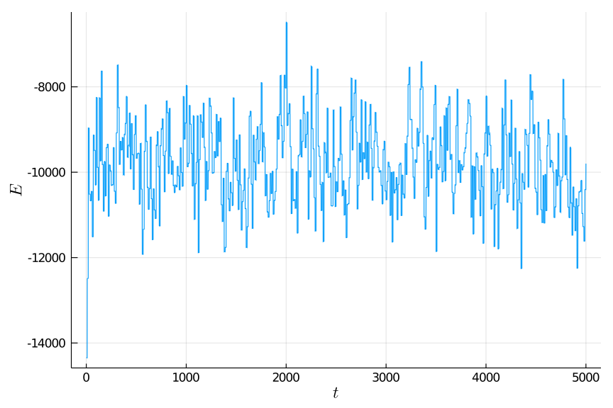

# Molecular Dynamics Simulator

This is a re-implementation of the [mdsim](https://github.com/cameronperot/mdsim) Python package in Julia.

## Basic Usage

```julia
using MDSim

params_dict = Dict(
	:N                         => 100,
	:d                         => 2,
	:m                         => 39.9,
	:T                         => 150,
	:τ                         => 0.01,
	:k_B                       => 0.8314462621026538,
	:ε_LJ                      => 99.3653225743385,
	:σ_LJ                      => 3.4,
	:seed                      => 8,
	:n_iter                    => 5000,
	:ensemble_type             => :NVT,
	:rescale_velocity_interval => 10,
	:L                         => 37.79644730092272,
	);

mdsim = MDSimulation(params_dict);
velocity_verlet!(mdsim);

using Plots; gr()
y = (mdsim.history.E_kin .+ mdsim.history.E_pot) / params_dict[:k_B];
x = 0:length(y)-1;
p = plot(x, y,
	dpi=144,
	xaxis=("\$t\$"),
	yaxis=("\$E\$"),
	legend=false
	)
savefig(p, "images/energy.png")
```


